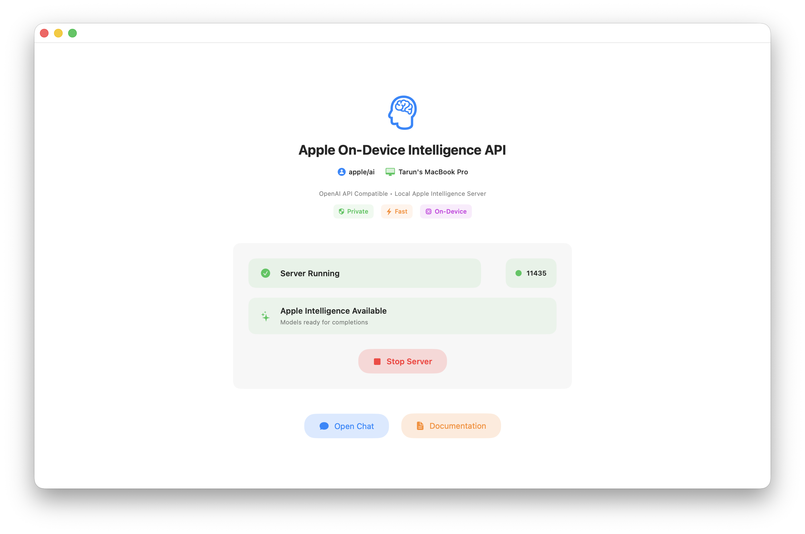
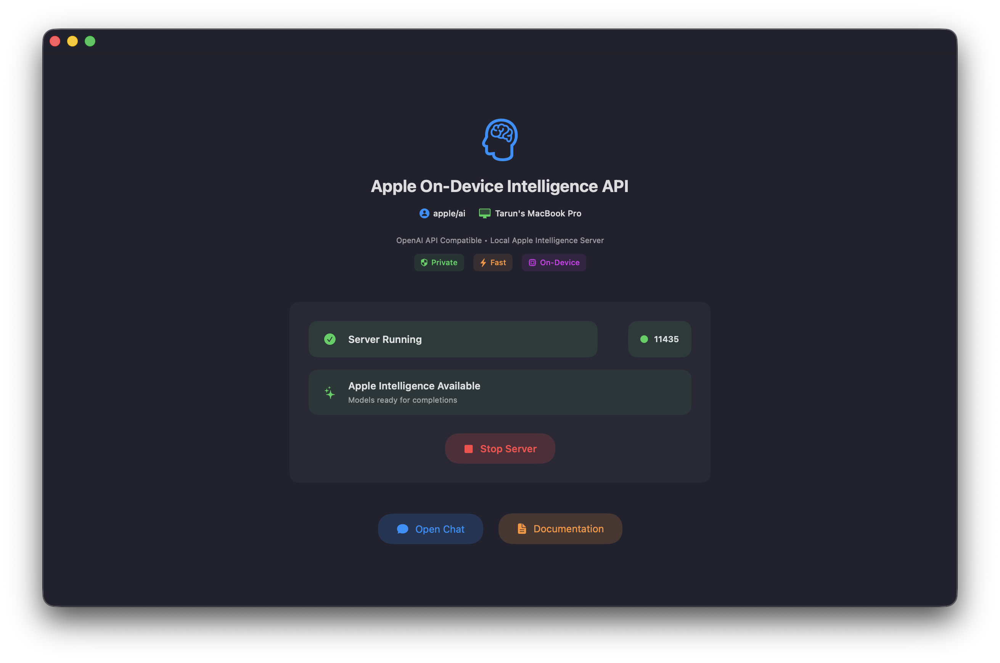
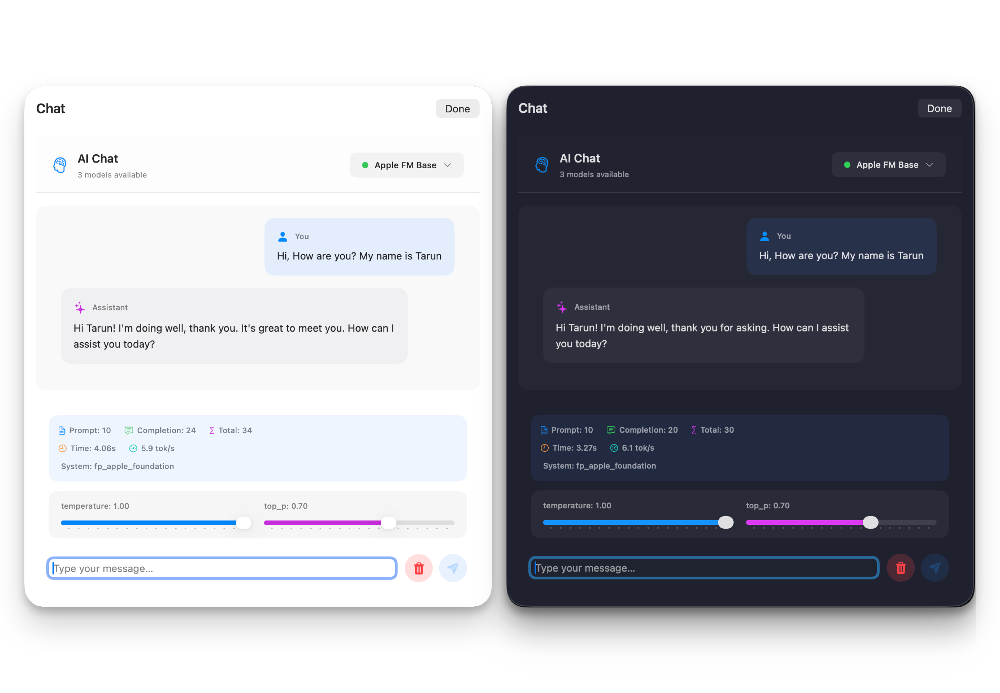

<div align="center">
  

  <h1>Apple On-Device OpenAI API Unified Server</h1>

  <p>
    <strong>OpenAI-compatible API server powered by Apple’s on-device Foundation Models</strong>
  </p>

  <p>
    <a href="#-features">Features</a> •
    <a href="#️-requirements">Requirements</a> •
    <a href="#-building-and-installation">Build & Install</a> •
    <a href="#-usage">Usage</a> •
    <a href="#-license">License</a> •
    <a href="#-references">References</a>
  </p>

  <br/>
</div>

## 🌟 Overview

A SwiftUI app that runs an OpenAI-compatible API server using Apple’s on-device Foundation Models, unifying **base**, **deterministic**, and **creative** variants under one endpoint for local use.

---

## 📸 App Screenshots

<div align="center">
  
  <p><em>Main Dashboard - Light Theme</em></p>
</div>

<div align="center">
  
  <p><em>Main Dashboard - Dark Theme</em></p>
</div>

<div align="center">
  
  <p><em>Chat Interface</em></p>
</div>

---

## 🚀 Features

| Feature                     | Description                                                          |
| --------------------------- | -------------------------------------------------------------------- |
| 🔁 **OpenAI Compatibility** | Drop-in replacement for OpenAI API with `/chat/completions` endpoint |
| ⚡ **Streaming Support**    | Real-time responses via OpenAI streaming format                      |
| 💻 **On-Device Processing** | Uses Apple Foundation Models — no external servers, fully local      |
| ✅ **Availability Check**   | Automatic Apple Intelligence availability check on startup           |

---

## 🛠️ Requirements

- **macOS**: 26 or greater
- **Apple Intelligence**: Must be enabled in _Settings → Apple Intelligence & Siri_
- **Xcode**: 26 or greater _(must match OS version for building)_

---

## 📦 Building and Installation

### Prerequisites

- macOS 26
- Xcode 26
- Apple Intelligence enabled

### Build Steps

1. Clone the repository
2. Open `AppleIntelligenceAPI.xcodeproj` in Xcode
3. Select your development team in project settings
4. Build and run the project (`⌘+R`)
5. The app will launch and start the server

---

## ❓ Why a GUI App Instead of CLI?

Apple applies different **rate limiting policies** to Foundation Models:

> “An app with UI in the foreground has no rate limit. A macOS CLI tool without UI is rate-limited.”  
> — Apple DTS Engineer ([source](https://developer.apple.com/forums/thread/787737))

⚠️ **Note**: You may still encounter limits due to current FoundationModels constraints. If that happens, restart the server.

---

## 📖 Usage

### Starting the Server

1. Launch the app
2. Configure server settings _(default: `127.0.0.1:11435`)_
3. Click **Start Server**
4. All three models will be served under OpenAI-compatible endpoints

---

## 📡 Available Endpoints

- `GET /status` → Model availability & status
- `GET /v1/models` → List models
- `POST /v1/chat/completions` → Chat completions (supports streaming)

---

## 💡 Example Usage

### Using `curl`

```bash
# English
curl -X POST http://127.0.0.1:11435/v1/chat/completions   -H "Content-Type: application/json"   -d '{
    "model": "apple-fm-base",
    "messages": [{"role": "user", "content": "Hello, how are you?"}],
    "temperature": 0.7,
    "stream": false
  }'

# French
curl -X POST http://127.0.0.1:11435/v1/chat/completions   -H "Content-Type: application/json"   -d '{
    "model": "apple-fm-base",
    "messages": [{"role": "user", "content": "Bonjour, comment allez-vous?"}],
    "stream": false
  }'

# Italian
curl -X POST http://127.0.0.1:11435/v1/chat/completions   -H "Content-Type: application/json"   -d '{
    "model": "apple-fm-base",
    "messages": [{"role": "user", "content": "Ciao, come stai?"}],
    "stream": false
  }'
```

### Using OpenAI Python Client

```python
from openai import OpenAI

client = OpenAI(base_url="http://127.0.0.1:11435/v1", api_key="not-needed")

# --- English (streaming example) ---
print("🔹 English:")
stream = client.chat.completions.create(
    model="apple-fm-base",
    messages=[{"role": "user", "content": "Hello, how are you?"}],
    temperature=0.7,
    stream=True,
)

for chunk in stream:
    if chunk.choices[0].delta.content:
        print(chunk.choices[0].delta.content, end="")
print("\n")

# --- French (non-streaming example) ---
print("🔹 French:")
resp_fr = client.chat.completions.create(
    model="apple-fm-base",
    messages=[{"role": "user", "content": "Bonjour, comment allez-vous?"}],
    stream=False,
)
print(resp_fr.choices[0].message.content)
print()

# --- Italian (non-streaming example) ---
print("🔹 Italian:")
resp_it = client.chat.completions.create(
    model="apple-fm-base",
    messages=[{"role": "user", "content": "Ciao, come stai?"}],
    stream=False,
)
print(resp_it.choices[0].message.content)

```

---

## 📜 License

This project is licensed under the **MIT License** — see [LICENSE](LICENSE).

---

## 📚 References

- [Apple Foundation Models Documentation](https://developer.apple.com/documentation/foundationmodels)
- [OpenAI API Reference](https://platform.openai.com/docs/api-reference)

---

<div align="center">
  <p><sub>Built with 🍎 + ❤️ by the open-source community</sub></p>
</div>
